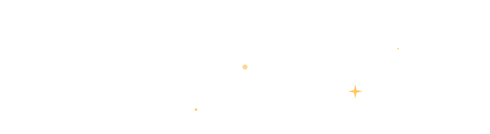
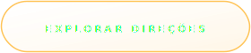

# 🌌 The Quartz Portal — World Design System

> "O universo conhece a ti mesmo, através do cosmos."

Este repositório é um **aplicativo conceitual interativo (SPA)** desenvolvido para apresentar três direções de design sob a filosofia de *Quiet Luxury* (luxo silencioso) para uma identidade corporativa. Em vez de uma entrega estática tradicional (PDF), a experiência foi construída como um portal vivo de calibração estética e design sensorial, rodando diretamente no GitHub Pages.

  

---

## 💎 A Filosofia e Estética do Portal

Enxergo a tecnologia como uma **extensão da mente humana**: um processo mecânico e complexo da expressão intelectual do saber universal que conecta histórias e aprendizados.

* **Consciência Assistida:** Escrever código é uma tentativa de moldar uma consciência assistida que se expande a partir da nossa percepção biológica, manipulando uma matéria fluida e invisível.
* **Equilíbrio e Resiliência:** Os sistemas aqui criados buscam o equilíbrio dos cristais e a resiliência mutável da água: transparentes, performáticos e destituídos de qualquer complexidade de infraestrutura que aprisione a liberdade criativa.

---

## 🗺️ As Três Direções do Quiet Luxury

O aplicativo permite ao usuário "sintonizar" e transmutar toda a interface do sistema para um de três avatares estéticos:

1. **Classic Heritage (O Luxo do Tempo):** Simetria, tons de areia quente, ouro envelhecido e tipografia serifada clássica.
2. **Biophilic Tech (O Luxo da Natureza Fluida):** Física de fluidos, tons verde-musgo profundo, platina e tipografia orgânica espaçada.
3. **Architectural Silence (O Luxo do Vazio):** Geometria pura, concreto arquitetônico, preto fosco e minimalismo espacial extremo.

---

## 📊 Telemetria Operacional

  

---

## 🛠️ Engenharia de Software

* **Arquitetura:** Single Page Application (SPA) nativa com transições de fade controladas via JS.
* **Física da Luz:** Micro-interações táteis e efeito de *glassmorphism* refrativo aplicados via CSS puro.
* **Performance:** Zero dependências de frameworks pesados, garantindo carregamento instantâneo a 60 FPS.

 

  

